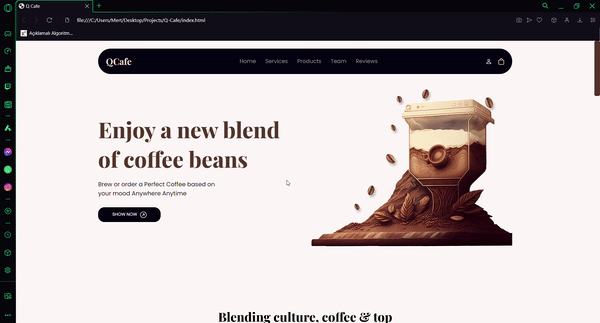

# ☕Q-CAFE
This project is a cafe web page that I created using modern HTML5 and CSS3 techniques. The page is designed to showcase a cafe's products, services, and contact information.

# 🎯Project Features:
• **Modern Design:** Sleek and user-friendly design.
• **Responsive Layout:** Flexible layout that works seamlessly on all devices (desktop, tablet, mobile).
• **HTML5:** Rich structural and semantic content.
• **CSS3:** Advanced styling options and animations.
• **Easy Navigation:** User-friendly menu and navigation options.

# 📼Preview:

